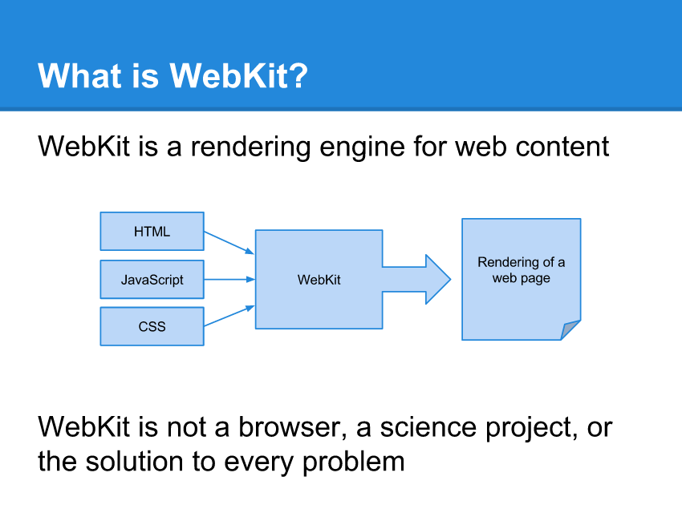
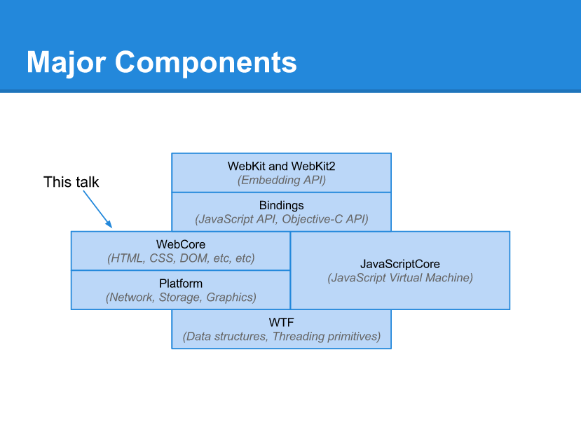

前言
===============

移动端开发过程中，webview是连接原生开发和web开发人员的桥梁和极为重要的容器，而webkit是webview的"引擎"，是web开发人员最常挂在嘴边的词语，所以，了解webkit和webview显得至关重要。

认识Webkit
===============

*什么是webkit？*

*主要组件*

webkit的主要认识误区
===========

**误区一：认为webkit是黑盒，给我们扔进去html, css, js之后，他就掌管了一切，最后渲染给用户一个页面**

**误区解释：WebKit才不是个黑盒。它是个白盒。并且，它是个打开的白盒。**

**原因**：

* 构成一个现代浏览器的组件大概有：
  
  * HTML、XML、CSS、JavsScript解析器
  * Layout
  * 文字和图形渲染
  * 图像解码
  * GPU交互
  * 网络访问
  * 硬件加速
  

* 所有webkit浏览器共同拥有的组件大概只有前两者，其他都由浏览器本身自行实现，所以说他是一个白盒不为过。

*  OS X上的实现（这也是最早和最原始的WebKit库）。但是你也能猜到，在Mac OS X下，许多不同的接口在很多不同的原生库下被实现，大部分集中在CoreFoundation。举例来说，如果你定义了一个纯色圆角的按钮，WebKit知道要去哪里，也知道要如何去绘制这个按钮。但是，绘制按钮的工作最终还是会落到CoreGraphics去。

--- infoQ 《[开发者需要了解的WebKit](http://www.infoq.com/cn/articles/webkit-for-developers)》

**误区一：单纯简单地认为移动端的webkit在安卓侧就是chrome for android；ios侧就是safari**

**误区解释：这是一个严重的误区，下文会阐述其区别**

WebView For Android
======

** 国产主流webkit内核
=============

* [腾讯x5](http://x5.tencent.com/)
* [ucweb的U3内核](http://www.uc.cn/business/developer/)

WebView For IOS
======
